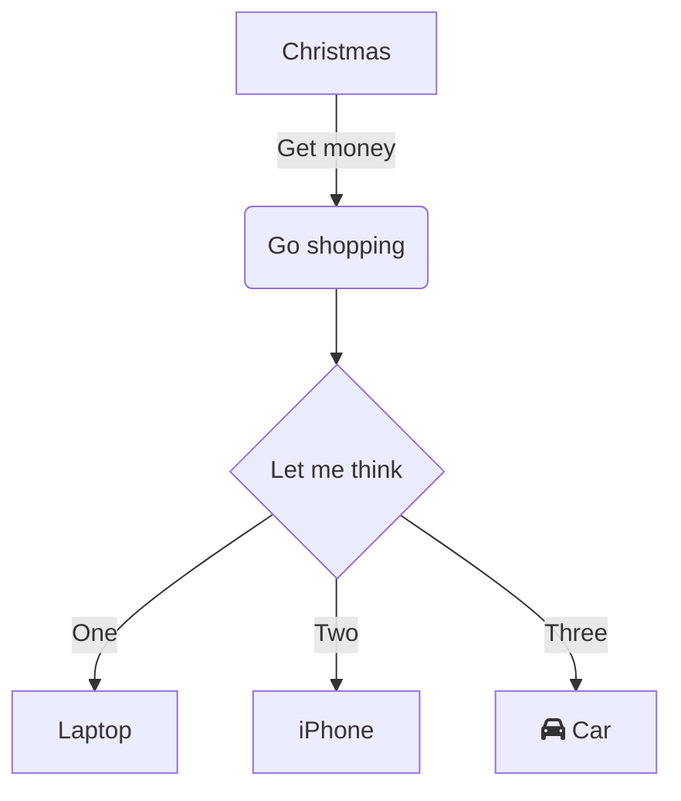
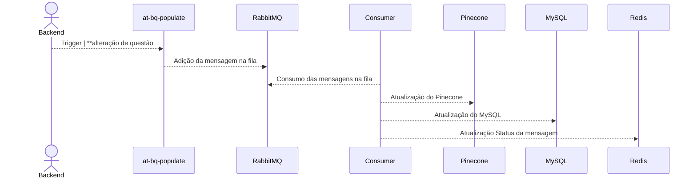

# DSA backend-qa

# Aspectos Gerais

- Stakeholders funcionais:
- Stakeholders técnicos:
- Data:
- Git repo:

# Objetivo

# 5W

Cinco W é um acrônimo em inglês que representa as principais perguntas que devem ser feitas e respondidas ao investigar e relatar um fato ou situação: Who? What? Where? When? Why?

## Who? Quem vai consumir essa aplicação?

## What? O que é essa aplicação?

## Where? Onde essa aplicação vai ser deployada?

## When? Para quando esperamos fazer o deploy dessa aplicação?

## Why? Por que precisamos do deploy essa aplicação?

# Benefícios da implementação do serviço

# Dores que estamos resolvendo

# Solução proposta (esquema de caixas)

Exemplo:

# Fluxo de funcionamento (esquema de fluxos)

Exemplo:

# Decisões arquiteturiais

# Infraestrutura/Volumetria

## Volumetria

Normalmente temos esses dados após efetuado algum teste de carga.

## Aplicação

- Package type: container
- Name: backend-qa
- Internal runtime: docker engine
- Interface: API
- Technology: python

## Dependências Externas

Coloque aqui tudo com o que essa aplicação vai precisar se conectar que não seja ela mesma: Bancos, Buckets, SQS...

- Name:
- Interface:
- Actions:
